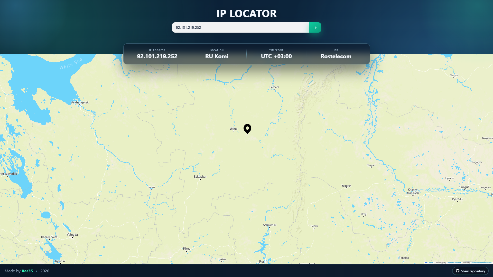

<p align="center">
  
</p>

<p align="center">
  <a href="https://github.com/x4r3s/ip-locator">
    
  </a>
  <a href="https://github.com/x4r3s/ip-locator/blob/main/LICENSE">
    
  </a>
</p>

<p align="center">
  
  
  
  
  
</p>

---

## 📌 About

**IP Locator** is a web application for tracking IP geolocation and visualizing it on an interactive map.

## 💻 Interface

<p align="center">
  
</p>

---

## 🛠 Technologies

| Technology | Description |
|-----------|-------------|
| HTML5 | Page structure |
| CSS3 | Visual styling and responsive layout |
| JavaScript | App logic and orchestration |
| Leaflet | Map rendering and interaction |
| Parcel | Development and production bundling |
| Geo.IPify API | IP/domain geolocation source |
| Mapbox Tiles API | Tile provider for map layers |

---

## 🌍 Browser Support

Works in modern browsers:

- ✅ Google Chrome
- ✅ Mozilla Firefox
- ✅ Microsoft Edge
- ✅ Safari

---

## 🚀 Getting Started

### 1. Install dependencies

```bash
npm install
```

### 2. Configure environment variables

```bash
cp .env.example .env
```

Edit `.env`:

```env
GEO_IPIFY_API_KEY=your_geo_ipify_api_key
MAPBOX_ACCESS_TOKEN=your_mapbox_access_token
```

### 3. Start development server

```bash
npm start
```

Open the URL from terminal output (usually `http://localhost:1234`).

---

## 📦 Production Build

```bash
npm run build
```

Build output is generated in `build/`.

---

## 📜 Available Scripts

- `npm start` - run Parcel dev server
- `npm run start:open` - run dev server and try to open browser automatically
- `npm run build` - create production build
- `npm run deploy` - deploy via Vercel